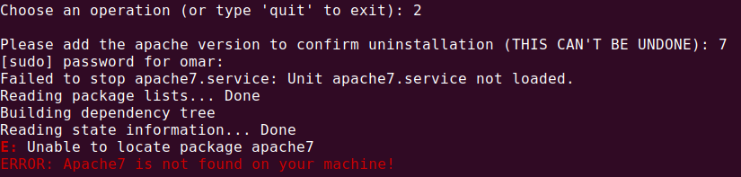
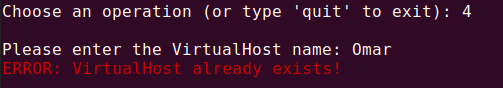

# <b>Webserver Admin Script</b>


> "Share your knowledge. It’s a way to achieve immortality."

---

### <b>Table of Contents</b>

- [Description](#Description)
- [How To Use and Screenshots](#how-to-use)
- [Author Info](#author-info)
- [License](#license)

---

## <b>Description</b>

This script provides all the basic operations that you need to simply manage your apache webserver.

#### <b>Features</b>
- You can install/remove apache webserver on your machine
- You can add/remove VirtualHosts on your machine
- You can disable/enable VirtualHosts.
- You can enable/disable basic type authentication on your VirtualHost using .htaccess file

#### <b>Technologies</b>

- Shell

[Back To The Top](#Webserver-Admin-Script)

---

## <b>How To Use</b>
1. You can download the script in your chosen directory then navigate to that directory
2. Type the following command in terminal to run the script:
```
./server_admin.sh
```
- If the command didn't work you can change the permissions using `chmod +x server_admin.sh` or you can run the following command:
```
bash server_admin.sh
```
- To run the script in debug mode you can use the following command:
```
bash -x server_admin.sh
```

### <b>Screenshots</b>







[Back To The Top](#Webserver-Admin-Script)

---

## <b>Author Info</b>

- Omar Yehia Ahmed - [Linkedin](https://www.linkedin.com/in/omar-yehia94/)


[Back To The Top](#Webserver-Admin-Script)

---

## <b>License</b>

MIT License

Copyright (c) [2021] [Omar Yehia]

Permission is hereby granted, free of charge, to any person obtaining a copy
of this software and associated documentation files (the "Software"), to deal
in the Software without restriction, including without limitation the rights
to use, copy, modify, merge, publish, distribute, sublicense, and/or sell
copies of the Software, and to permit persons to whom the Software is
furnished to do so, subject to the following conditions:

The above copyright notice and this permission notice shall be included in all
copies or substantial portions of the Software.

THE SOFTWARE IS PROVIDED "AS IS", WITHOUT WARRANTY OF ANY KIND, EXPRESS OR
IMPLIED, INCLUDING BUT NOT LIMITED TO THE WARRANTIES OF MERCHANTABILITY,
FITNESS FOR A PARTICULAR PURPOSE AND NONINFRINGEMENT. IN NO EVENT SHALL THE
AUTHORS OR COPYRIGHT HOLDERS BE LIABLE FOR ANY CLAIM, DAMAGES OR OTHER
LIABILITY, WHETHER IN AN ACTION OF CONTRACT, TORT OR OTHERWISE, ARISING FROM,
OUT OF OR IN CONNECTION WITH THE SOFTWARE OR THE USE OR OTHER DEALINGS IN THE
SOFTWARE.

[Back To The Top](#Webserver-Admin-Script)

---
